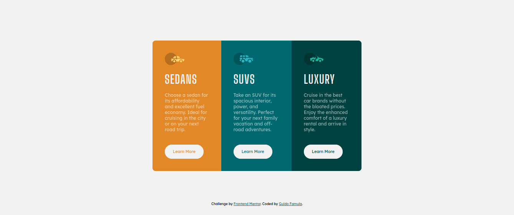
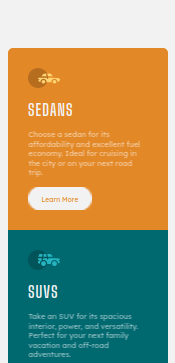

<h1 align="center">3-column Preview Card Component</h1>

</img>

   Challenge by  <a href="https://www.frontendmentor.io?ref=challenge" target="_blank">frontendmentor.io</a>. Coded by <a href="https://guidofamula.com">Guido Famula</a>.

  <h3>
    <a href="https://www.frontendmentor.io/solutions/3column-preview-card-component-ePiXk_mT3R" target='_blank' color="white">
      Solution URL
    </a>
   ~||~     <a target='_blank' href="https://guidofamula.github.io/3-column-card-solution/">
      Live URL
    </a>
   ~||~     <a target='_blank' href="https://www.frontendmentor.io/challenges/3column-preview-card-component-pH92eAR2-">
      Challenge URL
    </a>
  </h3>

 
 

## Table of contents

- [Overview](#overview)
  - [The challenge](#the-challenge)
  - [Mobile Version](#mobile-version)
- [My process](#my-process)
  - [Built with](#built-with)
  - [Useful resources](#useful-resources)
- [Author](#author)
- [Acknowledgments](#acknowledgments)

## Overview

### The challenge

Users should be able to:

- View the optimal layout depending on their device's screen size
- See hover states for interactive elements

### Mobile Version

<h2 align='center'>Mobile version</h2>

</img>

 

## My process

### Built with

- Semantic HTML5 markup
- CSS custom properties
- Flexbox
- Mobile-first workflow
- [Vite](https://vitejs.dev/) - Module Bundler
- [SASS](https://tailwindcss.com/) - For styles CSS Preprocessing

### Useful resources

- [Learn SASS](https://www.w3schools.com/sass/) - This is an amazing reference which helped me guiding the design. I'd recommend it to anyone still learning sass/scss .

## Author

- My Website - [GUIDOFAMULA.COM](https://guidofamula.com)
- Frontend Mentor - [@guidofamula](https://www.frontendmentor.io/profile/guidofamula)
- Linkedin - [Guido Famula](https://www.linkedin.com/in/guido-famula/)

## Acknowledgments

Thank you to all my friends or frontend mentor friends who often give me advice and guidance, so that I am more motivated and focused on living my activities as a frontend developer.
